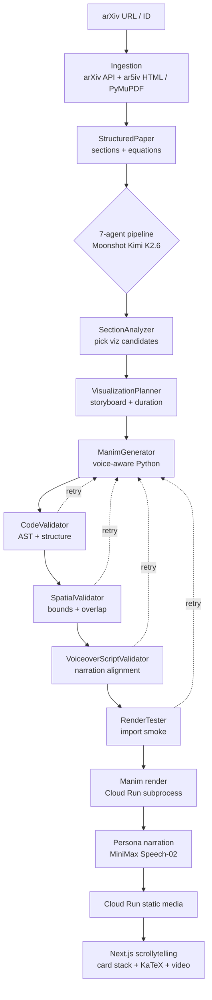

# paper-time 🎓

**Feynman & Friends — an AI tutor that interrupts itself.**

Paste any arXiv paper. Three voice personas (Feynman, a Skeptic, a Newbie) teach it to you through 3Blue1Brown-style Manim animations, narrated turn-by-turn. The pipeline writes the animation code, validates it, renders it, and serves the result as a horizontal scrollytelling card stack.

[](./LICENSE)


---

## 🏆 GOSIM Agentic Hackathon 2026 — Paris

> Built at **STATION F** for the **Education track** of the GOSIM Agentic Hackathon (May 5–6, 2026). Solo build by team **Frodo**.

Every external service the pipeline calls is a GOSIM sponsor offering. Provider selection is one config line per agent — Moonshot Kimi today, Zhipu or DeepSeek with a flag flip.

---

## 🚀 Live Demo

| | |
|---|---|
| 🌐 **App** | [paper-time.vercel.app](https://paper-time.vercel.app) |
| 📄 **Try it (cached, plays end-to-end)** | [paper-time.vercel.app/abs/1706.03762](https://paper-time.vercel.app/abs/1706.03762) |
| 🩺 **API health** | [paper-time-backend.../api/health](https://paper-time-backend-624600345344.europe-west1.run.app/api/health) |
| 💻 **Repo** | [github.com/m2moiz/paper-time](https://github.com/m2moiz/paper-time) |
| 🎬 **Demo video** | *(linked at submission time)* |

**Reviewers: open the *Try it* link.** No install, no signup. The cached "Attention Is All You Need" paper plays the full pipeline output.

---

## 🤝 Sponsor stack

The whole project plugs into the GOSIM sponsor ecosystem. Each sponsor service maps to a specific job in the pipeline.

| Sponsor | Role |
|---|---|
|  | The reasoning brain. Drives section analysis, Manim code generation, voiceover script writing, and persona dialogue. |
|  | The voice cast. Three distinct voices (Feynman / Skeptic / Newbie) for the cold-open and per-section narration. |
|  | Drop-in alternate reasoning model, selectable per agent for cost/latency tuning. |
|  | Long-context fallback for survey papers and dense multi-page sections. |
|  | Target voice front-end for the upcoming barge-in feature: low-latency speech capture for "press the mic and ask a question mid-playback". |

Provider isn't hard-coded anywhere. Model selection lives in `backend/agents/dedalus_base.py::MODEL_CHAINS`. Edit one string per agent and the whole stack moves to a different sponsor.

---

## 🎯 The problem

Research papers and dense textbooks are the highest-signal learning material humans produce. They are also the lowest-throughput. A motivated reader spends hours decoding notation that a 90-second animation could make obvious. Existing AI tools summarise. They don't teach.

**paper-time turns a paper into a guided multi-voice explainer with animations grounded in the original equations.** You see the math move. You hear it taught. You don't skim a paragraph and pretend you got it.

Reading a hard paper alone is mostly a willpower problem. A paced, multi-voice walkthrough makes it less of one.

---

## ✨ What it does today

1. **You paste an arXiv URL or ID.** Or click one of the suggested examples on the landing page.
2. **The pipeline ingests the paper.** Fetches HTML from `ar5iv` (with PyMuPDF fallback), extracts sections, normalises equations.
3. **A 7-agent pipeline plans, generates, and validates Manim code.** Section by section. Each visualization passes four quality gates (AST, spatial bounds, narration alignment, import smoke) and is regenerated on failure.
4. **Manim renders the animations.** Local subprocess on Cloud Run, or Modal serverless when load demands it.
5. **The frontend plays the result** as a horizontal scrollytelling card stack: section centred one at a time, KaTeX equations rendered live, video synchronised with narration.
6. **Cached demo:** *Attention Is All You Need* (`1706.03762`) ships with all 5 visualizations pre-rendered so reviewers see the end output immediately.

### Sample workflow

```
arxiv.org/abs/1706.03762
        │
        ▼
paper-time.vercel.app/abs/1706.03762
        │
        ▼
Sections appear → KaTeX renders → press play
→ Manim animation runs with narrated voiceover
→ scroll for the next section
```

First render of a fresh paper takes about 2 minutes end-to-end. Cached papers play instantly.

---

## 🪄 What makes it different

- **Animations, not summaries.** Every visualization is real Manim code, validated by four independent gates and re-generated on failure.
- **Equation-grounded.** LaTeX from the source paper is preserved through ingestion, regenerated as Manim `MathTex`, and rendered with KaTeX in the UI. No paraphrasing of math.
- **Scrollytelling player.** Vertical scroll drives a horizontal card stack: one section centred, math in motion.
- **Multi-agent quality gating.** Validators catch a bad Manim generation before render time, so we don't burn compute on code that won't run or animations that overflow the frame.

---

## 🎙️ The vision: Feynman & Friends

The product is named *Feynman & Friends* because the long-term goal is **three named voice personas teaching together, interruptible by voice**. The current build ships the rendering pipeline and the scrollytelling player. The persona layer and voice barge-in are next.

What the live experience is meant to feel like:

> Open a paper. The three personas spend 20 seconds setting the stakes out loud (the *cold open*). Scrollytelling starts. Feynman drives intuition. The Skeptic challenges assumptions. The Newbie asks the dumb question you wouldn't dare. At any point you press the mic and ask your own question. The system spawns a fresh sub-animation answering you in seconds, then returns to the main thread.

The cold-open agent and persona prompt-routing already exist on a separate branch and aren't yet wired into the deployed live demo.

---

## 🏗️ Architecture



Each visualization passes a 4-stage quality gate with up to N regeneration attempts before reaching the player. Failures persist as `error` on the visualization row, so the UI degrades gracefully: the section card still appears without a video.

### Tech stack

| Layer | What we use |
|---|---|
| **Frontend** | Next.js 16 (App Router), React 19, TypeScript strict, Tailwind v4, framer-motion, TanStack Query, KaTeX |
| **Backend** | Python 3.11+, FastAPI, async SQLAlchemy 2, `uv`, async-throttle |
| **Reasoning** | Moonshot AI Kimi K2.6 (primary), with Zhipu GLM-4.6 and DeepSeek as alternates. Routed via Dedalus gateway + Context7 MCP for live docs grounding. |
| **Voice** | MiniMax Speech-02 for the persona voice cast, manim-voiceover for scene timing |
| **Animation** | Manim Community 0.19, rendered as a subprocess on Cloud Run (Modal serverless available for spillover) |
| **Ingestion** | `arxiv` Python client, `pymupdf4llm` for PDF fallback, `beautifulsoup4` for ar5iv HTML |
| **Database** | SQLite (baked into the container as the seed cache for demo papers) |
| **Hosting** | Google Cloud Run for the backend (`europe-west1`), Vercel for the frontend |
| **Tooling** | `uv`, `pytest-asyncio`, ESLint flat config, Docker Compose |

---

## 🛠️ Quick start

### Docker (recommended)

```bash
docker compose up                                          # production-flavor
docker compose -f docker-compose.yml -f compose.dev.yml up # hot-reload backend
```

Open [http://localhost:3000](http://localhost:3000).

### Manual install

**macOS prerequisites:**

```bash
brew install uv node cairo pango ffmpeg sox
brew install --cask basictex
sudo tlmgr update --self && sudo tlmgr install standalone preview doublestroke \
  relsize fundus-calligra wasysym physics mathastext movie15 inputenc fontenc
```

**Backend:**

```bash
cd backend
cp .env.example .env   # fill in API keys (see Configuration)
uv sync
uv run uvicorn main:app --reload --host 0.0.0.0 --port 8000
```

**Frontend:**

```bash
cd frontend
npm install
npm run dev
```

---

## ⚙️ Configuration

Copy `backend/.env.example` to `backend/.env` and fill in:

| Variable | Required | Notes |
|---|---|---|
| `DEDALUS_API_KEY` | yes | Reasoning gateway. Routes to Moonshot Kimi K2.6 by default; alternate routing for Zhipu GLM-4.6 and DeepSeek per agent (see `MODEL_CHAINS` in `backend/agents/dedalus_base.py`) |
| `DEFAULT_MODEL_OVERRIDE` | no | Override the default sponsor model for one-off runs (e.g. `deepseek/deepseek-chat`) |
| `MINIMAX_API_KEY` | for voice | MiniMax Speech-02 narration. When set, the voiceover layer auto-selects MiniMax over gTTS |
| `MINIMAX_GROUP_ID` | for voice | Group ID associated with the MiniMax key |
| `MINIMAX_VOICE_ID` | no | Override the default voice preset (defaults are per persona — see `backend/agents/voice_services/minimax.py::PERSONA_VOICES`) |
| `MINIMAX_MODEL` | no | `speech-02-hd` (default, highest quality) or `speech-02-turbo` |
| `RENDER_MODE` | no | `local` (default, runs Manim as a subprocess) or `modal` for serverless renders |
| `MODAL_TOKEN_ID` | if `RENDER_MODE=modal` | Modal serverless renders |
| `DATABASE_URL` | no | Defaults to SQLite; set this for Postgres |

Frontend (`frontend/.env.local`):

| Variable | Required | Notes |
|---|---|---|
| `NEXT_PUBLIC_API_URL` | yes | Backend base URL |
| `NEXT_PUBLIC_USE_MOCK` | no | `"true"` to use mock fixtures (no backend) |

`.env` files are gitignored. Don't commit them.

---

## 📁 Project structure

```
backend/        FastAPI app, 7-agent pipeline, ingestion, rendering, DB
  agents/       SectionAnalyzer, VisualizationPlanner, ManimGenerator, validators
  api/          FastAPI router + Pydantic schemas
  ingestion/    arXiv fetcher, ar5iv parser, PyMuPDF fallback, section extractor
  rendering/    local subprocess + Modal serverless runners
  jobs/         async pipeline orchestrator
  db/           SQLAlchemy 2 async models + queries
frontend/       Next.js 16 App Router app
  app/          / and /abs/[...id] routes
  components/   CardStack, StackCard, SectionViewer, VideoPlayer, PersonaSelector
  lib/          API client, helpers, types
docs/           Deployment + architecture notes
```

---

## ☁️ Deployment

The live demo runs on the GOSIM-recommended cloud stack:

- **Frontend on Vercel.** Next.js 16 build with `NEXT_PUBLIC_API_URL` pointed at Cloud Run.
- **Backend on Google Cloud Run** (`europe-west1`). Built from `backend/Dockerfile`. The seed SQLite database is baked into the image (`backend/.gcloudignore` keeps `papertime.db` in the image), so cached demo papers play immediately on cold start.

Rendered MP4s are served from the Cloud Run container's local disk in the demo deployment. For durable storage at scale, the rendering layer also has a pluggable backend that can write to Cloud Storage or any S3-compatible object store; this is off by default.

---

## 🗺️ Roadmap

The hackathon shipped the rendering pipeline and the scrollytelling player. The full *Feynman & Friends* product vision continues with:

- **Personas in the live build.** Three named voices defined in `config/personas.json`, a UI persona selector that persists per browser, persona tone threaded through the voiceover prompt. The code already exists on a separate branch.
- **Cold-open intros.** When a paper is ready, the three personas auto-stream a 10–20 second spoken intro about the abstract using NDJSON streaming. Code exists; not yet wired to the live URL.
- **Per-scene persona dialogue.** Text-bubble overlays on top of the playing video showing 2–4 dialogue cues per visualization at video-time percentages.
- **Live "agents thinking" dashboard.** One column per pipeline agent, streaming each agent's status during a render. Demo-time flash for showing what's happening under the hood.
- **Multi-input ingestion.** Same `/api/process` endpoint handling textbook PDF upload and lecture-notes URL fetch alongside arXiv IDs.
- **Pre-warmed interrupt cache.** For each headline paper, pre-render 4 likely interrupt-question sub-scenes so cache hits play in <100 ms.
- **Voice barge-in (the killer feature).** Press the mic mid-playback, ask a question out loud, and a fresh Manim sub-animation answers within seconds before the main thread resumes. Wired around the cache above and the EchoKit Rust front-end for low-latency speech capture.
- **MiniMax Speech-02 voice cast wired into the live demo.** The architecture is already TTS-agnostic; the deployed build still uses cached gTTS for the cold-open while the MiniMax integration is finalised.

---

## ⚠️ Status & limitations

- **Internet required at runtime.** Reasoning and voice are cloud-hosted; offline rendering is not supported.
- **Cold start on a fresh paper takes ~2 minutes.** The cached `1706.03762` plays instantly.
- **Rendering is CPU-bound.** Cloud Run caps at 3 concurrent Manim subprocesses (`asyncio.Semaphore(3)`).
- **Voice barge-in is on the roadmap, not in the live build.** The deployed demo plays cached scrollytelling without interruption.
- **CORS is fully open** in the deployed backend (`allow_origins=["*"]`) for the hackathon demo. This needs tightening before any non-demo deployment.
- **The API is unauthenticated.** `/api/process` will accept any arXiv ID. Auth and rate-limiting are pre-production work.

---

## 🤝 Contributing

The codebase uses:

- `uv` for Python deps. Use `uv add` / `uv remove`. Don't `pip install` directly.
- `npm` for frontend deps.
- Conventional commits (`feat:`, `fix:`, `docs:`, `refactor:`, `chore:`, `test:`).
- ESLint flat config + TypeScript strict mode on the frontend.
- `pytest-asyncio` for backend tests.

---

## 📜 License

MIT. See [LICENSE](./LICENSE).
